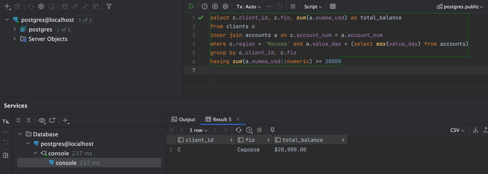
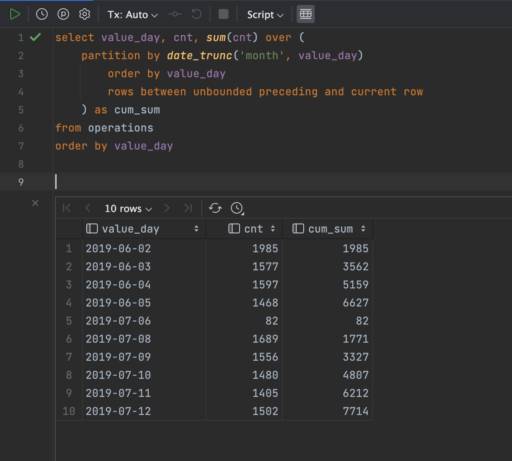
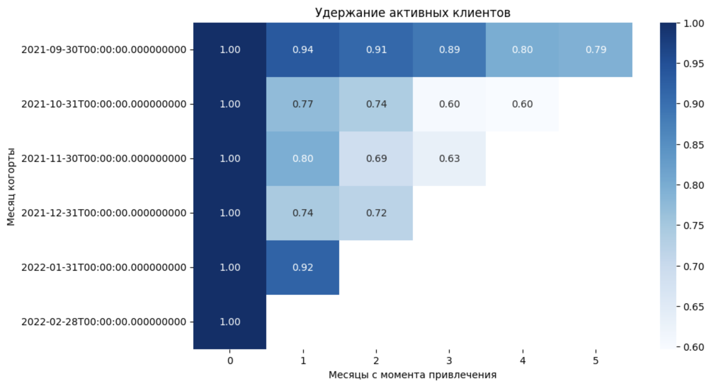
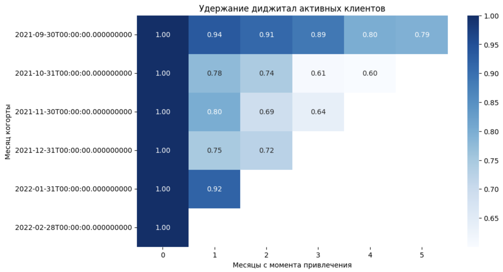
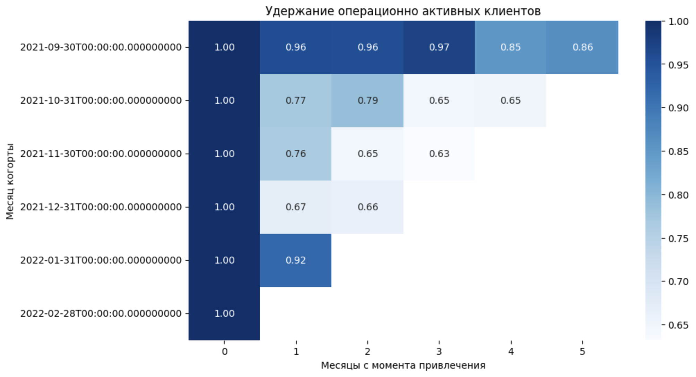
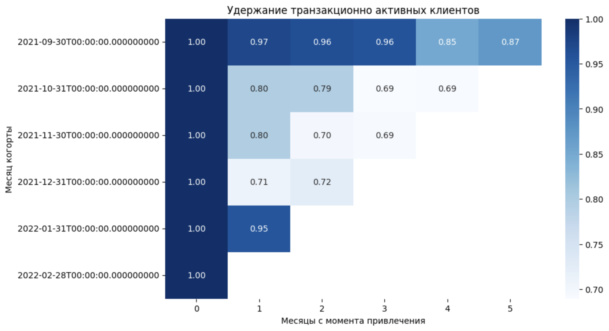

# 1. SQL
1. Отобрать клиентов по г. Москва с суммарными остатками по клиенту от 20 000 на последнюю дату, используя табличку с информацией о клиентах и табличку с информацией об остатках на счетах клиентов.
```sql 
select c.client_id, c.fio, sum(a.summa_usd) as total_balance
from clients c
inner join accounts a on c.account_num = a.account_num
where c.region = 'Москва' and a.value_day = (select max(value_day) from accounts)
group by c.client_id, c.fio
having sum(a.summa_usd) >= 20000`
```


2. Таблица Operations хранит информацию о количестве произведенных операций на каждую календарную дату.  
Вывести на каждую дату количество операций, совершенное с начала месяца по указанную дату включительно накопительным итогом. 

```sql 
select value_day, cnt, sum(cnt) over (
    partition by date_trunc('month', value_day)
        order by value_day
        rows between unbounded preceding and current row
    ) as cum_sum
from operations
order by value_day
```


3. Таблица Operations хранит информацию о количестве произведенных операций на каждую календарную дату.  
Вывести на каждую дату количество операций, совершенное с начала месяца по указанную дату включительно накопительным итогом. 
*Тут надо понять, что если из каждого месяца вычитать его порядковый номер (номер строки), то подряд идущие месяцы схлопнутся в одну и ту же дату, потом это поможет.*
```sql 
select value_day, cnt, sum(cnt) over (
    partition by date_trunc('month', value_day)
        order by value_day
        rows between unbounded preceding and current row
    ) as cum_sum
from operations
order by value_day
```


# 2. Метрики
Можно предположить, какие конкретно задачи решает витрина. Так как банк интересуют деньги, думаю нам инетересны каналы монетизации, оттуда каналы вовлечения и поведение юзеров.

Я бы составил воронку (показ витрнины - клик - переход - покупка). Исходя из этого можно смотреть на метрики CTR, конверсию в переходы и покупки. Банк при покупке у партнера получит комиссию, надо взять исторические данные GMV и высчитать сколько из этого взял банк. 
Но так как пользователи попадают в витрину через разные каналы, я бы отдельно считал их эффективность. Вдруг есть те партнеры, кто общие метрики тянет вниз? 

Если поумничать, то стоит учесть расходы на привлечение платящего клиента и смотреть на ARPU и ROI витрины, чтобы чистую прибыль посчитать. Как мастер дашбордов я бы предложил регулярно мниторить MAU/DAU витрины, если просадка есть - фиксировать среднее время юзера на экране (мб там баннер непривлекательный?). После набора платящих юзеров стоит заглянуть, как часто они начинают возвращаться за покупкой и retention покажет, встроился ли продукт в жизнь клиента.

# 3. Когортный Анализ

[Работа выполнена в Jupyter Notebook тут](pics/task.ipynb)

Удержание активных клиентов


Удержание диджитал активных клиентов


Удержание операционно активных клиентов


Удержание транзакционно активных клиентов


- Четверть пользователей заходят в приложение, но не совершают операций/транзакций!
Возможно, приложение юзают, чтобы посмотреть баланс, проверить траты. Или его не привлекают активности на экране, ему не хочется никуда больше тыкать, кроме своего целевого действия. У них нет регулярных платежей, чтобы их совершать. Но возможно, кому-то просто удобнее делать это не в приложении, а в вебе, где крупнее.

- Ключевым фактором является вовлеченность, ибо юзеры, совершающие операции, заходят в приложение в среднем в 3 раза чаще и снова предполагаем, что часть юзеров использует приложение в пассивном режиме 

- Полагаю, что для проверки гипотез необходимо провести сегментацию пользователей, анализ частоты входов и построение воронки 

Если получится увеличить вовлеченность, то основной точкой роста вижу увеличение конверсии из диджитал активности в операционную. Вероятно, в этом поможет упрощение пользовательских сценариев и внедрения мотивационных механик (или геймификации в UI).


